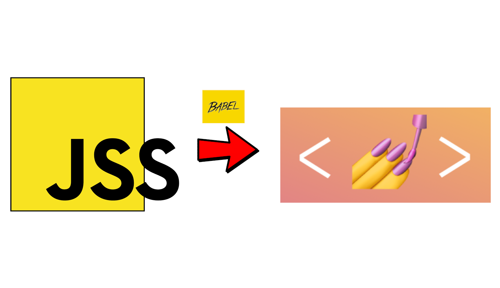

# jss-to-styled-components

🚧 WIP  
Babel codemod designed to migrate from react-jss to styled-components.



## Motivation

Our large codebase React switched to the popular CSS-in-JS livrary `styled-components`, after 1-2 years of development with `react-jss`.  
No hard feeling towards react-jss, as the main reason for the move was achieving consistency across the tech stack of our products, as we were the only ones using jss.

And that could have been the end of the story. The "older" code would live peacefully with Jss, and the new one would use styled-components.

But what if we could write a script that could do the migration automatically? Looking at what it would take, that seemed like an overwhelming complex task.

Enter Babel, codemods and ASTs.

## Options

- **-h** or **-help**  
  Help
- **-dry-run**  
  The script is run, but your files aren't modified.  
  A good way to check if the script blows up (and where) on your codebase.
- **-f** _path_  
  Path of the file to run the script on

- **-d** _path_  
  Path of the directory to run the script on.  
  The script will be run recursively on all files and folders contains in this folders, except for a few exceptions (`node_modules`, `.git`, `public`, `temp`, ...)

- **-remove-composes-only**
  The script will only process the `composes` property in the Jss classes.  
  Must be used with the `css` option.

- **-css** _path_  
  Css file's path  
  Used to resolve the JSS's `composes` property.  
  In the example below, the script doesn't know what are `mx-auto` and `border-top`, as they are specific to the application.

  ```
  const styles = {
    container: {
      composes: "mx-auto border-top",
      marginTop: 8,
    },
  }
  ```

  But default, it will pass it as `className` to the generated styled-component

  ```
  const Container = styled.div.attrs({
      className: "mx-auto border-top"
  })`
    margin-top: 8px;
  `
  ```

  You have the option of resolving those css classes.

  ```
    // my-custom-css.js
    .border-top {
      border-top-style: solid;
      border-top-width: 1px;
    }

    .mx-auto {
      margin-left: auto;
      margin-right: auto;
    }
  ```

  The ouput will then be:

  ```
    const Container = styled.div`
    margin-top: 8px;
    margin-left: auto;
    margin-right: auto;
    border-top-style: solid;
    border-top-width: 1px;
  `
  ```
